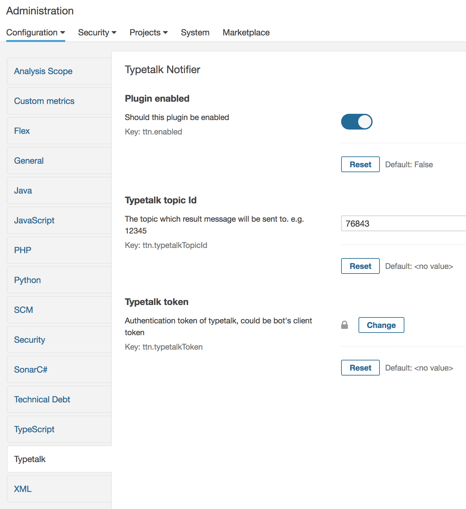

# Sonarqube Typetalk Notifier Plugin


This is a custom plugin for [Sonarqube](https://www.sonarqube.org/) - Continuous code quality inspection tool.

This plugin will notify [Typetalk](https://typetalk.com) chat application with measurement result in Quality gate when new analysis finished.

## Install plugin
Copy the built Jar plugin to Sonarqube server plugin directory in `<Sonarqube home>/extensions/plugins/`.
Restart the Sonarqube server

**Sonarqube on Docker**
If you are using [Docker compose file](https://github.com/SonarSource/docker-sonarqube/blob/master/recipes.md), copy the plugin to the container volume:

```bash
// sonarqube_sonarqube_1 is container name
docker cp sonarqube-typetalk-plugin-0.1.jar sonarqube_sonarqube_1:/opt/sonarqube/extensions/plugins/
docker-compose restart
```

## Usage
Create a Typetalk Sonar bot for topic and [obtain its token](https://developer.nulab-inc.com/docs/typetalk/)

In Sonarqube server, go to *Administration* tab > *Configuration* > *Typetalk*


When there is a new analysis, Sonar bot will post a message on Typetalk with all measures in Quality gate. Name for custom metrics can be post properly, too.


## Todo:
-[ ] Can select which project to be notified.